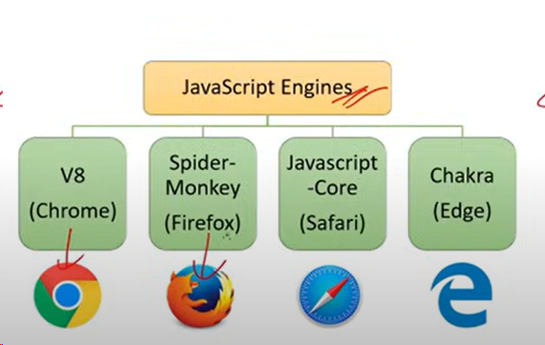
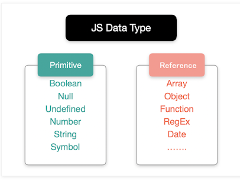
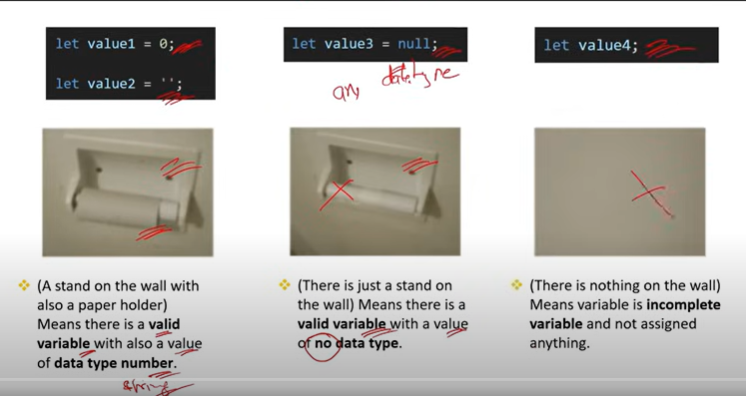

# javascript_interview_questions
This is a repo which i was following " Interview Happy" (https://www.youtube.com/watch?v=AUTO7ALJk2U) channel to sharpen my knowledge. Find 100 question and practicing the answers. 

# Chapter 1: Basic Javascript
# Q1 -  What is Javascript ? What is the role of JS engine ?
    JavaScript is a programming language that isused for converting static web pages to interactive and dynamic web pages

    As shown in above picture, every browser it has an JavaScript engine inbuilted. this engine is a program present in web browser that execute JavaScript code. Internaly the respond from the server of JS code executed by these engine on the front-end.

# Q2 - What are Client side and Server site ?
    A Client is a devise, application, or software component that requests and consumes services or resources froma Server.
    A Server is a devise, computer, or software application that provides services, resources, or functions to clients.

# Q3 - What is Scope in JavaScript ?
    //Global Scope - Accessible anywhere
    let globalVariable = "global"

    greet()

    function greet(){
        //Function scope - accessible inside function only 
        let functionVariable = "function"

        if(true){
            //Block scope - Accessible inside block only
            let blockVariable = "block"
        }
    }

# Q4 - What is the type of a variable  in JS when it is declared without using the  var, let, or const keyword ?

    eg: code snipet
    if(true) {
        variable =10
    }
    console.log(variable)
    what is the output ? or will it provide any out put ?

    Answer : Output : 10
    Note : "var"  is the implicit type of variable when a variable is declared without var,let, or const keyword.

# Q5 - WHat is "Hoisting" in JavaScript ?

    Eg:
    // Function hoisting                // variable  hoisting 
    myFunction()                        x =10
                                        console.log(x)
    function myFunction(){              //output: 10
        console.log("Hello !")          
    }                                   var x

    //Out put : Hello !

    Javascript is follows Top-Down approach,even though Hoisting is define as a function/variable can be called  before it gets initilize.

    Note : JavaScript Engine will be pulled the function/variable initilization  on top of function/variable calls during the compile time

    Note : If you use "let" keyword for variable declaration for the above example it will give an error it is because "let" will not  allow "Hoisting" functionality

    Definition : Hoisting is a JavaScript behavior where functions and variable declarations are moved to the top of their respective scopes during the compilation phase.

# Q6 - What is JSON ?
    JSON (JavaScript Object NOtation) is a lightweight data interchaange format.
    JSON consist of key-value pair

# Chapter 2 : Variable & Datatypes
# Q7 - What are variable? What is the difference between var,let, and const?
    Variable used to store data

    "var" create a function-scoped variable
    Eg: 
    // using var
    function exapleVar(){

    if (true) {
        var count = 10
        console.log(count)
        //Output ; 10
    }
    console.log(count)
    // Output : 10

    }

    "let" create a block-scoped variable
    Eg: 
    // using let
    function exapleLet(){

    if (true) {
        let count = 10
        console.log(count)
        //Output ; 10
    }
    console.log(count)
    // Output : Uncaught
    //Reference error: count is not defined

    }

    Note : "const" cretae a block-scoped variable behave same as let but  is can be assigned only once, and its value cannot be changed afterwards.

    Eg: 
    // Using constant
    const z = 10
    z = 20
    //This iwill result in an error 
    console.log(z)

# Q8 - What are data types in JS?

    A datatype will determine the type of a variable . JS by default you dont specify the  data type of the variable that you assigned , it will automatically assingthe type by itself based on the value that you entered. So you dont write thetype explicitly.

    Still there are 2 types of variable found in JS..

    Primitive - Can be sotred/hold only one and single value
    Non-Primitive - can be stored/hold multiple values

# Q9 - WHat is the different between primitive and non-primitive data type (DT)?

    Primitive - DT
    - This type can only hold single value.
    - These are immutable, meaning their values, once assigned, cannot be changed.

    Eg: 

    Note : Immutable means things that cannot be chnaged or modified

    Non-Primitive - NDT

    - This type can only hold multiple value.
    - These are mmutable, meaning their values can be chnaged 

# Q10 - What is the diffferent between "null" and "undefined" in JS?

